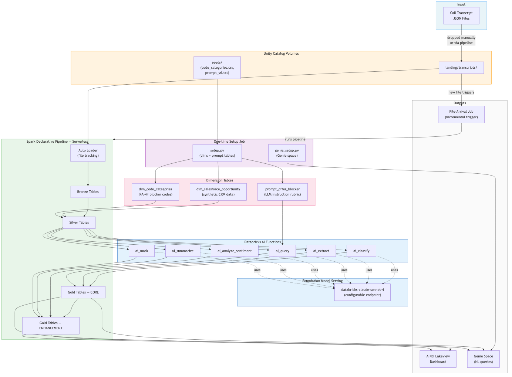

# Superior Plus Propane — Offer Blocker Analysis

Automated Databricks pipeline that reads sales call transcripts and produces a
coded table of **offer blockers**: the specific reasons a customer declined a
propane service offer.

Replaces a manual "paste transcripts into a ChatGPT session" workflow with an
incremental, re-runnable pipeline built on **Auto Loader**, **Spark Declarative
Pipelines (SDP)**, and **Databricks AI Functions**, running entirely on serverless
compute.

---

## Background for engineers

A propane sales rep calls a prospect. If the customer doesn't sign up, there's a
reason: the rate was too high, a fee was unacceptable, the contract terms didn't
fit, etc. These are "offer blockers." The original process was: paste call
transcripts into a ChatGPT session, get a table back, copy it into a spreadsheet.
This pipeline automates that process end-to-end.

**Blocker taxonomy (6 codes):**

| Code | Name | What it covers |
|------|------|----------------|
| 4A | Rate Uncompetitive | Per-unit price is too high vs. competitor or threshold |
| 4B | Ancillary Fees | Delivery, tank rental, inspection, or admin fees break the deal |
| 4C | Commercial Model | Customer needs pre-buy, fixed vs. variable pricing, or different commitment length |
| 4D | Contract Mechanics | Auto-renewal, cancellation terms, or billing terms are the barrier |
| 4E | Availability / Serviceability | Superior structurally cannot provide the product or coverage |
| 4F | Promotion Ineligibility | Customer wanted a discount/referral credit that couldn't be applied |

---

## Two tiers of functionality

Every object in the pipeline is labelled with a tier:

| Tier | Marker | Meaning |
|------|--------|---------|
| **CORE** | no suffix | Faithfully reproduces the original hand-written Python scripts (`original/*.py`) |
| **ENHANCEMENT** | suffix `_enh` | Net-new AI capability that did not exist in the original workflow |

---

## Architecture



**Key components:**

- **Unity Catalog Volumes** — governed file storage. `landing/transcripts/` is the Auto Loader source; `seeds/` holds reference CSVs.
- **Dimension tables** — `dim_salesforce_opportunity` (synthetic CRM data linking phone numbers to deal IDs and regions), `dim_code_categories` (the 4A–4F taxonomy), `prompt_offer_blocker` (the full LLM instruction rubric as a Delta table row).
- **Spark Declarative Pipeline (SDP)** — defines bronze/silver/gold datasets as SQL files; runs on serverless compute with no cluster to manage.
- **Databricks AI Functions** — six built-in SQL functions (`ai_query`, `ai_classify`, `ai_extract`, `ai_analyze_sentiment`, `ai_summarize`, `ai_mask`) call the foundation model endpoint from inside SQL without any Python orchestration.
- **Foundation Model Serving** — a Databricks-hosted endpoint (default: `databricks-claude-sonnet-4`). Swappable via the `model_endpoint` variable, no code change required.
- **AI/BI Dashboard** — Lakeview dashboard deployed as a native DAB resource, showing KPIs, blocker-code breakdowns, per-call tone/topic (enhancement), a findings table, and an Ask Genie button.
- **Genie Space** — natural-language query layer curated over the gold tables, provisioned by the setup job.
- **File-Arrival Job** — fires the pipeline automatically whenever a new transcript file is dropped into the landing Volume.

---

## Data flow

```
landing/*.json ──Auto Loader──▶ bronze_transcripts_ingest ──AUTO CDC (dedup on id)──▶ bronze_transcripts
                                                                                          │
dim_salesforce_opportunity (synthetic) ───────────────────────────────────────────────┐  │
                                                                                        ▼  ▼
                                        silver_transcript_sf_joined  (phone-join, Seg X of N, region filter)
                                                        │
                                                        ▼
                                        silver_opportunity_dialogue  (one dialogue string per opportunity)
                                          │                         │
   dim_code_categories (labels) ──▶ silver_issue_signals            │   [CORE: ai_classify code, ai_extract rate]
                                          │                         │
   prompt_offer_blocker (prompt) ──▶ gold_findings_raw  (ai_query, hinted by the signals)
                                          │
                                          ▼
                       gold_offer_blocker_findings   ◀── THE deliverable ("AI Output" sheet)
                          ├─ gold_batch_inventory     (validation: "Detected N segments across M opportunities")
                          ├─ gold_primary_check       (validation: one Primary=Yes per blocker opp)
                          └─ gold_findings_quarantine (validation: suspect rows; normally empty)

── ENHANCEMENT (suffix _enh) ─────────────────────────────────────────────────────────────────
   silver_transcript_sf_joined ──▶ gold_call_enrichment_enh   (per call: sentiment · topic · NER · summary · PII-masked summary)
   silver_opportunity_dialogue + findings ──▶ gold_followup_email_enh   (per opportunity: blocker-aware follow-up email in JSON)
```


### Bronze — ingest and deduplicate

| Table | Type | What it does |
|-------|------|--------------|
| `bronze_transcripts_ingest` | Streaming Table | Auto Loader reads new JSON files from the landing Volume; appends raw records |
| `bronze_transcripts` | Streaming Table | AUTO CDC deduplicates on `id` (SCD Type 1); exactly one row per call |

Auto Loader tracks which files it has already processed, so re-runs never re-ingest the same file.

### Silver — joins, windowing, and dialogue assembly

| Table | Type | What it does |
|-------|------|--------------|
| `silver_transcript_sf_joined` | Materialized View | Normalizes phone numbers to 10 digits; inner-joins to `dim_salesforce_opportunity` to attach `opportunity_id`, stage, and region; numbers each call as "Seg X of N"; filters to the configured regions |
| `silver_opportunity_dialogue` | Materialized View | Collapses all calls for one opportunity into a single prompt-ready transcript string (one row per opportunity) |
| `silver_issue_signals` | Materialized View | Runs `ai_classify` (multi-label, codes 4A–4F) and `ai_extract` (quoted rate) once per opportunity to produce lightweight hints |

### Gold — CORE (mirrors the original spreadsheet)

| Table | Type | What it does |
|-------|------|--------------|
| `gold_findings_raw` | Materialized View | Calls `ai_query` once per opportunity with the full instruction prompt + signals; returns a raw JSON findings array |
| `gold_offer_blocker_findings` | Materialized View | **THE DELIVERABLE.** Parses and explodes the JSON into one row per finding; columns mirror the original "AI Output" sheet (Version, Batch, Opp ID, Salesforce Stage, Rate, Code, Code Name, Primary, Qualifier, Disposition, Confidence, Evidence) |
| `gold_batch_inventory` | Materialized View | Validation: confirms the expected count of segments and opportunities |
| `gold_primary_check` | Materialized View | Validation: one Primary=Yes per opportunity that has a blocker |
| `gold_findings_quarantine` | Materialized View | Rows that failed data-quality expectations (normally empty) |

### Gold — ENHANCEMENT (net-new AI)

| Table | Type | What it does |
|-------|------|--------------|
| `gold_call_enrichment_enh` | Materialized View | Per-call: `ai_analyze_sentiment` → call tone; `ai_classify` → call topic; `ai_extract` → CRM entities (name, supplier, tank size, city, promotions); `ai_summarize` → 40-word summary; `ai_mask` → PII-redacted summary |
| `gold_followup_email_enh` | Materialized View | Per-opportunity: `ai_query` drafts a blocker-aware follow-up email in strict JSON (subject, greeting, call summary, blocker acknowledgement, next step, closing) |

### How the AI Functions are used

| Function | CORE use | ENHANCEMENT use |
|----------|----------|-----------------|
| `ai_classify` | Candidate blocker codes 4A–4F (`silver_issue_signals`) | Call topic routing (`gold_call_enrichment_enh`) |
| `ai_extract` | Quoted rate NER (`silver_issue_signals`) | CRM entities: name, supplier, tank size, city (`gold_call_enrichment_enh`) |
| `ai_query` | Compound offer-blocker findings (`gold_findings_raw`) | Blocker-aware follow-up email (`gold_followup_email_enh`) |
| `ai_analyze_sentiment` | — | Customer call tone (`gold_call_enrichment_enh`) |
| `ai_summarize` | — | Agent-facing call summary (`gold_call_enrichment_enh`) |
| `ai_mask` | — | PII redaction of the summary (`gold_call_enrichment_enh`) |

---

## Project layout

```
superior-offer-blocker/
├── databricks.yml                  Bundle manifest + all variables
├── resources/
│   ├── offer_blocker.pipeline.yml  SDP pipeline (serverless, all SQL files)
│   ├── setup.job.yml               One-time setup job
│   ├── offer_blocker.job.yml       Ingest job with file-arrival trigger
│   └── offer_blocker.dashboard.yml AI/BI dashboard (native DAB resource)
├── src/
│   ├── pipeline/                   One SQL file per dataset (bronze/silver/gold)
│   │   ├── bronze_transcripts.sql
│   │   ├── silver_transcript_sf_joined.sql
│   │   ├── silver_opportunity_dialogue.sql
│   │   ├── silver_issue_signals.sql
│   │   ├── gold_findings_raw.sql
│   │   ├── gold_offer_blocker_findings.sql
│   │   ├── gold_batch_inventory.sql
│   │   ├── gold_primary_check.sql
│   │   ├── gold_findings_quarantine.sql
│   │   ├── gold_call_enrichment_enh.sql
│   │   └── gold_followup_email_enh.sql
│   ├── setup/
│   │   ├── setup.py                Creates volumes, dims, prompt table, copies sample
│   │   └── genie_setup.py          Idempotently provisions the Genie space
│   └── dashboards/
│       └── offer_blocker.lvdash.json  Serialized AI/BI dashboard
├── seeds/
│   ├── code_categories.csv         4A–4F blocker-code catalog
│   └── offer_blocker_prompt_v6.txt Full LLM instruction rubric (v6)
├── genie/
│   └── genie_agent.json            Genie space definition
└── data/
    └── batch_b_ny_001.json         Sample batch (19 calls) for the demo
```

---

## Deployment — new environment

### Prerequisites

| Requirement | Notes |
|-------------|-------|
| Databricks workspace | Unity Catalog enabled |
| Databricks CLI ≥ 1.0 | `databricks --version` |
| Unity Catalog catalog + schema | Must exist or be creatable by the deploying principal |
| Foundation model serving endpoint | Must support **batch inference** (e.g. `databricks-claude-sonnet-4`). Check with `databricks serving-endpoints list --profile <PROFILE>` |
| SQL warehouse | For the AI/BI dashboard and Genie space |

### Step 1 — Configure your profile

```bash
# Authenticate (OAuth is recommended)
databricks auth login --host https://<your-workspace>.azuredatabricks.net --profile my-profile
```

### Step 2 — Review and override variables

All environment-specific values live in `databricks.yml` under `variables:`. Override any of them at deploy time with `--var key=value`.

| Variable | Default | What to change |
|----------|---------|----------------|
| `catalog` | `dbw_brlui_stable` | Your target Unity Catalog catalog |
| `schema` | `call_transcripts_poc` | Schema inside that catalog |
| `model_endpoint` | `databricks-claude-sonnet-4` | Any batch-inference-capable endpoint |
| `warehouse_id` | `50ad3a9993503e5b` | Your SQL warehouse ID |
| `region_1` / `region_2` | `New York` / `New Jersey` | Sales regions to include (others are filtered out) |
| `prompt_version` | `v6` | Label recorded in the output `Version` column |
| `batch_label` | `B-NY-001` | Label recorded in the output `Batch` column |
| `input_multiline` | `true` | `true` = one JSON array per file; `false` = JSON Lines (JSONL) |

Also update `targets.dev.workspace.host` in `databricks.yml` to point to your workspace.

### Step 3 — Validate and deploy

```bash
PROFILE=my-profile
CATALOG=my_catalog
SCHEMA=my_schema
WAREHOUSE=<your-warehouse-id>

cd superior-offer-blocker

# Validate the bundle
databricks bundle validate -t dev -p $PROFILE \
  --var catalog=$CATALOG \
  --var schema=$SCHEMA \
  --var warehouse_id=$WAREHOUSE

# Deploy all resources (pipeline, jobs, dashboard)
databricks bundle deploy -t dev -p $PROFILE \
  --var catalog=$CATALOG \
  --var schema=$SCHEMA \
  --var warehouse_id=$WAREHOUSE
```

### Step 4 — One-time setup

Creates volumes, copies the sample transcript, and builds the dimension tables and prompt table. Run this once per new environment.

```bash
databricks bundle run setup_job -t dev -p $PROFILE \
  --var catalog=$CATALOG \
  --var schema=$SCHEMA
```

### Step 5 — Run the pipeline

```bash
databricks bundle run offer_blocker_pipeline -t dev -p $PROFILE \
  --var catalog=$CATALOG \
  --var schema=$SCHEMA
```

### Step 6 — Verify

```sql
-- Check segment inventory
SELECT inventory_line FROM <catalog>.<schema>.gold_batch_inventory;
-- Expected: "Detected 16 segments across 13 opportunities."

-- Inspect findings
SELECT * FROM <catalog>.<schema>.gold_offer_blocker_findings WHERE Code <> '—';

-- Enhancement: per-call enrichment
SELECT call_tone, call_topic, call_summary, call_summary_masked
FROM <catalog>.<schema>.gold_call_enrichment_enh;

-- Enhancement: follow-up emails
SELECT opportunity_id, email_json
FROM <catalog>.<schema>.gold_followup_email_enh;
```

### Step 7 — Incremental batches

Drop a new `*.json` file into the landing Volume and the file-arrival trigger fires automatically:

```bash
# Copy a new batch file (e.g. from local or another Volume)
databricks fs cp local_batch.json \
  dbfs:/Volumes/$CATALOG/$SCHEMA/landing/transcripts/batch_c_ny_002.json \
  -p $PROFILE
```

Auto Loader processes only the new file; existing records are not re-processed.

---

## Changing the model

The model endpoint is fully parameterized. To switch models:

```bash
databricks bundle deploy -t dev -p $PROFILE --var model_endpoint=databricks-meta-llama-3-3-70b-instruct
databricks bundle run offer_blocker_pipeline -t dev -p $PROFILE --var model_endpoint=databricks-meta-llama-3-3-70b-instruct
```

The endpoint must support **batch inference**. Some pay-per-token endpoints (e.g. `claude-sonnet-5`) do not yet support batch; verify with the serving-endpoints API before switching.

---

## Demo run result (sample batch)

Running the pipeline against `data/batch_b_ny_001.json` (19 calls) produces:

- `gold_batch_inventory`: `"Detected 16 segments across 13 opportunities."` — 3 out-of-region opportunities correctly filtered out
- `gold_offer_blocker_findings`: findings coded across 4A / 4B / 4D / 4E / 4F with real transcript evidence quoted in `Evidence`
- `gold_findings_quarantine`: 0 rows (all findings passed data-quality expectations)
- `gold_call_enrichment_enh`: per-call sentiment, topic, entities, and summary populated with PII masked
- `gold_followup_email_enh`: a complete blocker-aware follow-up email drafted per opportunity

---

## Notes and known deviations from the original

- **Model family:** the original used Azure OpenAI (GPT-4). This pipeline uses a Databricks-hosted Claude endpoint. Expect to re-calibrate the prompt when changing model families.
- **`confidence` field:** categorical (High / Medium / Low) to match the original rubric and spreadsheet. The original Python used a 0–1 float.
- **Salesforce data is synthetic.** Phone numbers in the sample are mapped to fabricated Salesforce opportunity IDs, stages, and regions. In production, replace `dim_salesforce_opportunity` with a real Salesforce sync.
- **`input_multiline=true`** is set for the demo sample (a single JSON array). Set to `false` for production JSONL files.
- **Chunking and integrity trailer** from the manual ChatGPT workflow are replaced by parallel per-opportunity inference + pipeline Expectations + the validation views.
