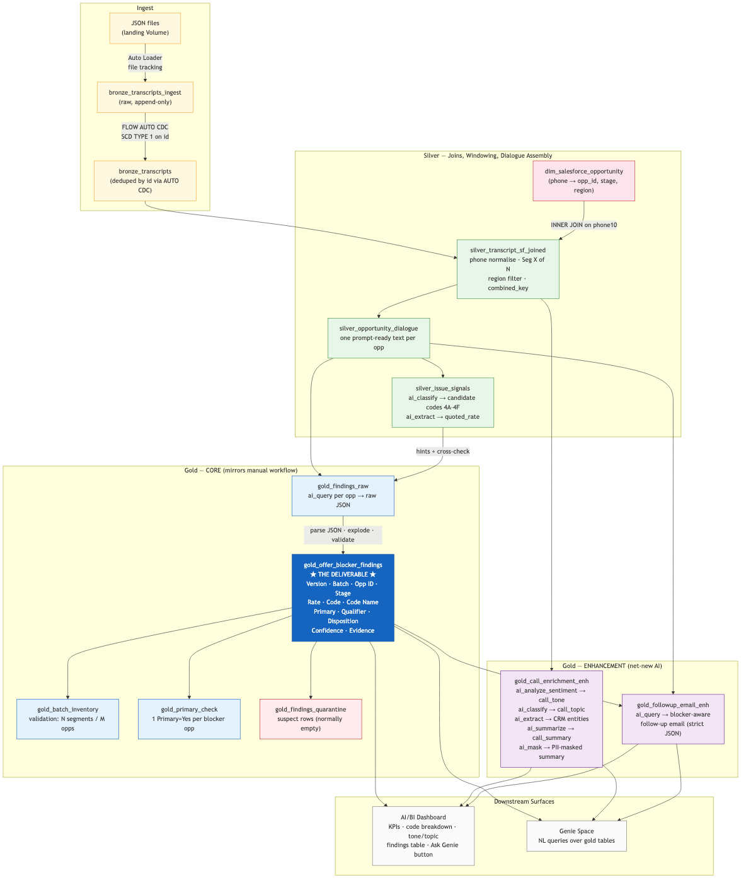
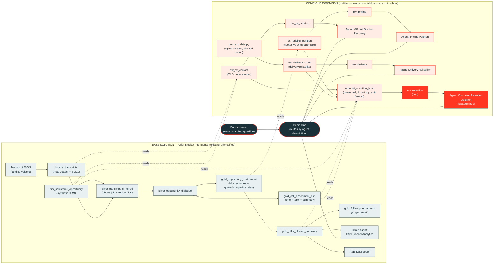

# Superior Plus Propane — Offer Blocker Intelligence

This repository turns Superior Plus Propane sales-call transcripts into structured offer-blocker intelligence on Databricks. It replaces a manual transcript-to-LLM workflow with a serverless Spark Declarative Pipeline, curated Genie agent, and multi-page AI/BI coaching dashboard.

The deployable project is [`superior-offer-blocker/`](superior-offer-blocker/).

> **New: Multi-domain Genie One demo extension.** An **additive** (zero existing files
> modified) extension turns the single-domain Offer Blocker solution into a five-Agent,
> **native Genie One** demo anchored on a strategic outcome — *retention-aware pricing*.
> Start at the package front door: **[`docs/GENIE_ONE_DEMO_INDEX.md`](docs/GENIE_ONE_DEMO_INDEX.md)**.
> See the [Genie One demo extension](#genie-one-demo-extension-additive) section below.

## What it does

The solution:

1. Incrementally ingests transcript JSON with Auto Loader.
2. Deduplicates calls by ID using AUTO CDC.
3. Joins calls to synthetic Salesforce opportunities and assembles one dialogue per opportunity.
4. Uses Databricks AI Functions to classify blocker codes, extract quoted rates, assign dispositions and qualifiers, and enrich each call.
5. Publishes an analyst-friendly blocker summary, coaching signals, and generated follow-up emails.
6. Exposes the results through a curated Genie agent and AI/BI dashboard.

### Blocker taxonomy

| Code | Category | Examples |
|---|---|---|
| 4A | Rate competitiveness | High quoted rate, competitor comparison, price-match request |
| 4B | Ancillary fees | Delivery, rental, installation, inspection, or admin fees |
| 4C | Commercial model | Pre-buy, tank ownership, pricing mechanism, commitment length |
| 4D | Contract mechanics | Auto-renewal, exit terms, billing, or transaction process |
| 4E | Availability/serviceability | Coverage, product, equipment, site, or timeline gap |
| 4F | Promotion eligibility | Referral, threshold, ownership, timing, or policy restrictions |

## Current architecture


### Data Flow



### Pipeline datasets

| Dataset | Type | Purpose |
|---|---|---|
| `bronze_transcripts_ingest` | Streaming table | Incrementally reads transcript JSON and records source metadata |
| `bronze_transcripts` | Streaming table | SCD Type 1 deduplication by call ID |
| `silver_transcript_sf_joined` | Materialized view | Normalizes phones, joins Salesforce opportunities, applies region filters, and numbers call segments |
| `silver_opportunity_dialogue` | Materialized view | Produces one ordered, prompt-ready dialogue per opportunity |
| `gold_opportunity_enrichment` | Materialized view | Classifies candidate blocker codes and extracts structured quoted/competitor rates |
| `gold_offer_blockers` | Materialized view | Classifies disposition and code-specific qualifier, with confidence and evidence |
| `gold_offer_blocker_summary` | Materialized view | Final spreadsheet-style blocker output used by the dashboard and Genie |
| `gold_call_enrichment_enh` | Materialized view | Adds tone, topic, CRM entities, summary, masking, similarity, and grammar signals per call |
| `gold_followup_email_enh` | Materialized view | Generates a concise blocker-aware follow-up email per opportunity |

### AI Functions

The current implementation uses:

- `ai_classify` for blocker codes, dispositions, qualifiers, and call topics.
- `ai_extract` for quoted rates, competitor rates, and CRM-style entities.
- `ai_analyze_sentiment` for customer tone.
- `ai_summarize` and `ai_mask` for concise, PII-safe call summaries.
- `ai_similarity` and `ai_fix_grammar` for coaching-oriented enrichment.
- `ai_query` with `databricks-claude-opus-4-8` for structured follow-up emails.
- `ai_top_drivers` in the exploratory notebook for contribution analysis.

## Analytics experiences

### Genie agent

- Name: **Offer Blocker Analytics**
- Workspace ID: `01f19cba5b581c9a81e28d0502069ec6`
- Version-controlled definition: [`superior-offer-blocker/genie/genie_agent.json`](superior-offer-blocker/genie/genie_agent.json)
- Coverage: six curated tables, six sample questions, 17 example SQL questions, consolidated instructions, and a benchmark.

The setup job provisions or updates the agent from the checked-in JSON.

### AI/BI dashboard

- Name: **Sales Call Coaching — Offer Blocker Intelligence**
- Source workspace ID: `01f1a70334b0114384592a2536bbe4f2`
- Version-controlled definition: [`superior-offer-blocker/src/dashboards/offer_blocker.lvdash.json`](superior-offer-blocker/src/dashboards/offer_blocker.lvdash.json)
- Pages: Executive Overview, Call Intelligence & Coaching, Global Filters, and AI Insights.
- Datasets: blocker findings, call enrichment, and competitive intelligence.
- The dashboard links to the curated Genie agent above.

The dashboard was created manually and then imported into the bundle source. Before a future deployment to the existing development target, explicitly bind the DAB resource key `offer_blocker_dashboard` to the dashboard ID above. Otherwise, the existing bundle state may still target the older dashboard.

## Genie One demo extension (additive)

The [`docs/GENIE_ONE_DEMO_INDEX.md`](docs/GENIE_ONE_DEMO_INDEX.md) package extends this
solution into a **multi-domain, native Genie One** demo. It is **strictly additive** — every
artifact is net-new and **no existing pipeline, table, job, dashboard, or Genie definition is
modified**. It is built to the conventions in
[databricks/databricks-agent-skills](https://github.com/databricks/databricks-agent-skills).

### Design constraints

- **Native Genie One only** — no Supervisor Agent / Agent Bricks. Genie One routes each
  question to the single most relevant **Genie Agent** by that Agent's `description`.
  Because native routing does not live-join four Agents, all cross-domain synthesis is
  **pre-joined in the pipeline** into a governed metric view and exposed through one hub Agent.
- **Additive only** — new objects read from the existing published tables and never write to
  or alter them. New pipeline code lives in a separate `pipeline_ext/` root with its own
  resource files.

### Five Genie Agents under Genie One

| Agent | Metric-view source | Status |
|---|---|---|
| Offer Blocker Analytics | (existing tables) | Existing |
| CX & Service Recovery | `mv_cx_service` | New |
| Delivery Reliability | `mv_delivery` | New |
| Pricing Position | `mv_pricing` | New |
| **Customer Retention Decision** (strategic hub) | `mv_retention` | New |

The Retention Decision Agent carries the cross-domain "raise vs protect" story. Its
`mv_retention` metric view is sourced from `account_retention_base`, which pre-aggregates each
domain fact to `opportunity_id` grain **before** joining (anti-fan-out). The three domain Agents
provide single-domain drill-downs the talk track routes to.

### End-to-end data flow (base + Genie One extension)

The diagram below shows the full architecture. The **base solution** (top) is unchanged; the
**Genie One extension** (bottom) reads from the base's published tables and adds net-new facts,
a pre-joined base view, four governed metric views, and four Genie Agents — all surfaced through
native **Genie One**, which routes each question to one Agent by its `description`.



**How to read it:** solid arrows are build-time data lineage; dotted arrows are the extension's
read-only dependencies on published base tables; the dark node is native Genie One routing across
all five Agents. The orange hub (`mv_retention` → **Customer Retention Decision**) is where the
pre-joined cross-domain answer lives, so no demo question depends on Genie live-joining two Agents.

### Extension objects (all net-new)

| Path | Purpose |
|---|---|
| `pipeline_ext/transformations/gold/ext_cx_contact.sql` | CX/contact-center fact from `bronze_transcripts` (LEFT JOIN preserves non-sales calls) |
| `pipeline_ext/transformations/gold/ext_pricing_position.sql` | Pricing fact — real `ai_extract` rates + synthetic list rate / fee load |
| `pipeline_ext/transformations/gold/ext_delivery_order.sql` | Delivery-reliability fact reading the synthetic seed |
| `pipeline_ext/transformations/gold/account_retention_base.sql` | Multi-fact base view, one row per `opportunity_id`, pre-aggregated |
| `src/metric_views/mv_{cx_service,pricing,delivery,retention}.metric_view.sql` | Four governed metric views (`mv_retention` is the hub) |
| `src/setup_ext/gen_ext_data.py` | Spark+Faker synthetic delivery seed (skewed, story-driven, `is_synthetic`) |
| `src/setup_ext/genie_setup_ext.py` | Additive, parameterized Agent-provisioning notebook |
| `genie_ext/build_genie_*.py` → `genie_*.json` | Four Agent build scripts and validated `serialized_space` v2 JSONs |
| `genie_ext/create_agents_cli.sh` | CLI fallback to provision the four Agents (catalog remap) |
| `resources/genie_one.pipeline.yml` | Additive SDP (separate root/glob) |
| `resources/genie_one_setup_ext.job.yml` | Seeds synthetic delivery before the ext pipeline |
| `resources/genie_one_metric_views.job.yml` | Deploys the four metric views (retention last) |
| `resources/genie_one.job.yml` | Provisions the four new Genie Agents |

### Deploy order

```bash
cd superior-offer-blocker
PROFILE=<your-profile>

databricks bundle validate --strict --target dev --profile "$PROFILE"
databricks bundle deploy               --target dev --profile "$PROFILE"
databricks bundle run genie_one_setup_ext_job    --target dev --profile "$PROFILE"  # seed synthetic delivery
databricks bundle run genie_one_ext_pipeline     --target dev --profile "$PROFILE"  # facts + base view
databricks bundle run genie_one_metric_views_job --target dev --profile "$PROFILE"  # 4 metric views
databricks bundle run genie_one_setup_job        --target dev --profile "$PROFILE"  # 4 Genie Agents
```

Prerequisite: the existing `setup_job` must already have created `dim_salesforce_opportunity`.
Metric-view metadata requires **DBR 17.3+**. Full details, validation queries, the 20-minute
talk track, and a demo-day cheat-sheet are in
[`docs/GENIE_ONE_DEMO_INDEX.md`](docs/GENIE_ONE_DEMO_INDEX.md) and
[`superior-offer-blocker/genie_ext/DEPLOY_RUNBOOK.md`](superior-offer-blocker/genie_ext/DEPLOY_RUNBOOK.md).

## Repository layout

```text
.
├── README.md
├── docs/                              Architecture, data-flow diagrams, and Genie One demo package
│   ├── GENIE_ONE_DEMO_INDEX.md        Front door for the Genie One demo extension
│   ├── genie_one_demo_onepager.html   Slide-ready strategy one-pager
│   ├── genie_one_demo_talktrack.md    20-minute demo talk track
│   ├── genie_one_additive_implementation.md
│   └── genie_one_demo_build_tasks.md
├── examples/                          Sanitized inputs and reference outputs
├── original/                          Original hand-written Python workflow
└── superior-offer-blocker/
    ├── databricks.yml                 Bundle variables and development target
    ├── README.md                      Bundle-level overview
    ├── resources/
    │   ├── offer_blocker.pipeline.yml Serverless SDP definition
    │   ├── offer_blocker.job.yml      File-arrival pipeline job
    │   ├── setup.job.yml              Setup and Genie provisioning job
    │   ├── offer_blocker.dashboard.yml
    │   ├── genie_one.pipeline.yml      [ext] Additive SDP: domain facts + base view
    │   ├── genie_one_setup_ext.job.yml [ext] Synthetic delivery seed job
    │   ├── genie_one_metric_views.job.yml [ext] Metric-view deploy job
    │   └── genie_one.job.yml           [ext] Genie Agent provisioning job
    ├── pipeline/
    │   ├── transformations/
    │   │   ├── bronze/
    │   │   ├── silver/
    │   │   └── gold/
    │   └── explorations/
    │       └── ai_top_drivers_exploration.py
    ├── pipeline_ext/                   [ext] Additive pipeline root
    │   └── transformations/gold/       ext_cx_contact, ext_pricing_position,
    │                                   ext_delivery_order, account_retention_base
    ├── src/
    │   ├── setup/
    │   │   ├── setup.py
    │   │   └── genie_setup.py
    │   ├── setup_ext/                  [ext] gen_ext_data.py, genie_setup_ext.py
    │   ├── metric_views/               [ext] mv_cx_service, mv_pricing, mv_delivery, mv_retention
    │   └── dashboards/
    │       └── offer_blocker.lvdash.json
    ├── genie/
    │   └── genie_agent.json
    ├── genie_ext/                      [ext] Agent builders + JSONs, CLI fallback,
    │                                   README, DEPLOY_RUNBOOK, DEMO_DAY_CHEATSHEET
    ├── data/
    │   └── batch_b_ny_001.json
    └── seeds/
        ├── code_categories.csv
        └── offer_blocker_prompt_v6.txt
```

## Setup objects

The `setup_job` creates or refreshes:

- The Unity Catalog `landing` volume and `landing/transcripts` directory.
- The bundled sample transcript in the landing directory.
- `dim_salesforce_opportunity`, a deterministic synthetic CRM mapping for the demo.
- `lookup_qualifier_config`, which contains code-specific labels and instructions for qualifier classification.
- The **Offer Blocker Analytics** Genie agent from the checked-in definition.

## Bundle configuration

The default development configuration uses:

| Variable | Default |
|---|---|
| `catalog` | `dbw_brlui_stable` |
| `schema` | `call_transcripts_poc` |
| `warehouse_id` | `50ad3a9993503e5b` |
| `prompt_version` | `v6` |
| `region_1` / `region_2` | `New York` / `New Jersey` |
| `input_multiline` | `true` |

The bundle still declares `model_endpoint` and `batch_label` for compatibility, but the current live pipeline does not pass those values into its configuration. The follow-up-email model is currently specified directly in SQL.

## Validate and run

Choose the Databricks CLI profile explicitly; never rely on implicit profile selection.

```bash
cd superior-offer-blocker

PROFILE=<your-profile>

databricks bundle validate --strict --target dev --profile "$PROFILE"
databricks bundle deploy --target dev --profile "$PROFILE"
databricks bundle run setup_job --target dev --profile "$PROFILE"
databricks bundle run offer_blocker_pipeline --target dev --profile "$PROFILE"
```

Dropping another JSON file into the configured landing volume triggers `offer_blocker_ingest_job`. Development-mode deployments keep its file-arrival trigger paused unless explicitly enabled.

## Notes

- The included Salesforce opportunity data is synthetic and intended for demonstration.
- The sample file is a JSON array, so `input_multiline=true`; use `false` for JSON Lines input.
- The current pipeline source root is `pipeline/`, and only `pipeline/transformations/**` is included as pipeline code. Exploratory notebooks are retained beside it but are not executed by the pipeline.
- Workspace-authored source, Genie, dashboard, job, and pipeline changes were reconciled into this repository without deploying or modifying workspace resources.
